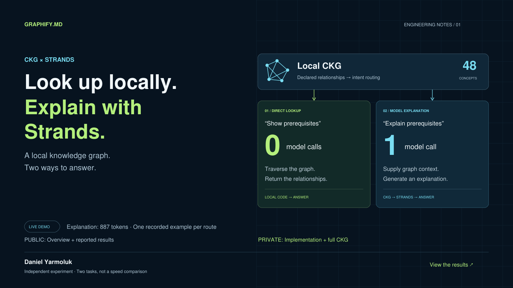

# CKG × Strands

### Look up locally. Explain with Strands.

**[View the showcase →](https://yarmoluk.github.io/ckg-strands-showcase/)** · [How it works](#the-pattern) · [Results & limitations](RESULTS.md)

**Not every supported question needs a model call.** This experiment connects a local Compact Knowledge Graph (CKG) to a Strands agent and makes the choice explicit: return declared relationships directly, or use the same evidence to generate an explanation.

Built by **[Daniel Yarmoluk](https://github.com/Yarmoluk)** / **[Graphify.md](https://graphifymd.com)**.

## The pattern

| Request | Route | Model calls |
|---|---|---:|
| **“Show prerequisites of thread_id”** | A local lookup returns declared relationships | **0** |
| **“Explain the prerequisites of thread_id”** | Strands receives graph context and generates prose | **1** |

A CKG organizes concepts and typed relationships into a compact knowledge artifact. Here, local code answers supported prerequisite queries by following declared relationships. It supplies that evidence to Strands when the request asks for an explanation.

The useful boundary is between **retrieving a stored relationship** and **generating prose about it**. The routing decision itself does not need a model.

## What worked in the live demonstration

| Measurement | Local lookup | Model explanation |
|---|---:|---:|
| Model calls | **0** | **1** |
| Request processing | **0.109 ms** | **7.064 s** |
| Model tokens | None | **887** |

Recorded September 22, 2026, with one example per route and a 48-concept fixture. These are **different tasks, not a head-to-head speed comparison**. Graph loading took 0.670 ms separately. Request time excludes Python startup and printing.

The result is a working integration and routing boundary. Generated explanations still require verification: the recorded answer added claims beyond its supplied graph evidence.

**[Read the full measurement summary →](RESULTS.md)**

## What changed during the experiment

The earlier selective-context extension used fewer tokens than a full-CSV baseline, but took longer because the model still invoked a fallback lookup tool. The resulting extra model round trips motivated the combined approach: supported lookups return directly; explanations receive evidence before generation.

This does not establish that the combined approach is universally faster or more accurate. It demonstrates a practical way to decide where model work is useful.

## What is public

| Included here | Kept private |
|---|---|
| Project explanation and architecture artwork | Implementation and integration source code |
| Aggregate reported measurements and limitations | Full CKG and relationship exports |
| Social post and presentation images | Extraction, authoring, and generation methods |
| Static project website | Raw execution traces and test fixtures |

This is a **presentation repository**. It contains no runnable agent, downloadable CKG, graph explorer, or embedded graph dataset. The website displays the same presentation materials.

The validation badge reports tests of the private demonstration. The public package-check badge verifies the small, explicit file inventory of this showcase; it is not an independent validation of the private experiment.

## Where to go next

- **[Visit the project page](https://yarmoluk.github.io/ckg-strands-showcase/)** for the visual overview.
- **[Read the results](RESULTS.md)** for measurements, scope, and the earlier comparison.
- **[Read the post](social/post.md)** for the short version.
- **[Contact Daniel](https://github.com/Yarmoluk)** to discuss the integration pattern.

---

Independent experimental integration using the Strands Agents Python SDK. This is not an official Strands integration or a change to the separate Strands Harness SDK. Strands, Claude, and LangGraph identify the technologies demonstrated; no affiliation or endorsement is implied.
